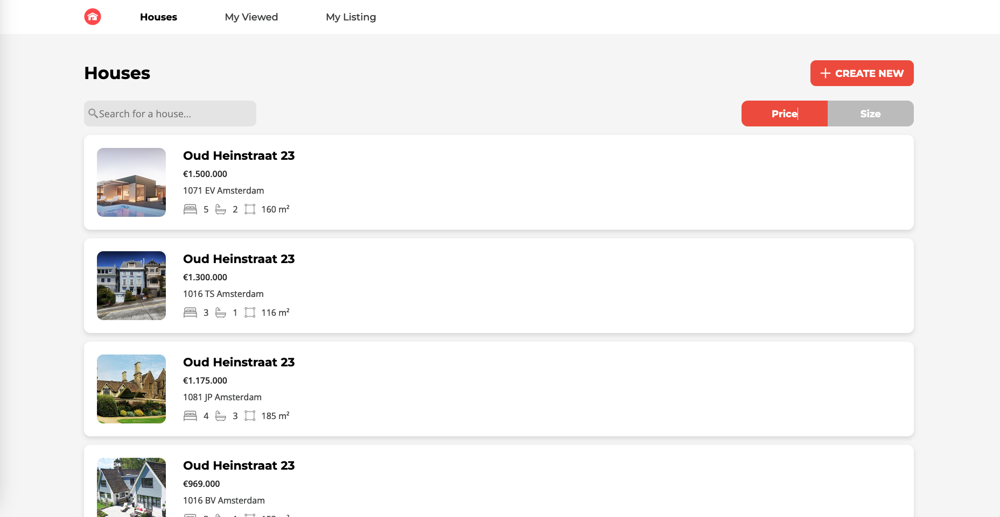
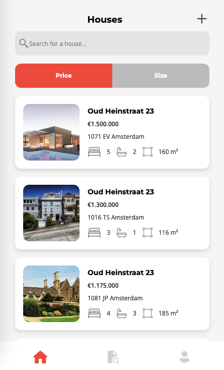

# House Listing CRUD App
**A web application for house listings, which allows the user to view a list of houses that are currently available for sale, and create, edit and delete their own listings. User can also see the history of the houses she/he has viewed and all self-created listings.**

## Tech Stack
HTML, CSS, and JavaScript (Vue.js as framework, with pinia for state management)  

## Hightlights
- <u>Optimize web performance by processing necessary data</u> <br> Instead of reformatting data at each step, transform API data to POST format only when required (edit form). 
<br>Store "viewed IDs" as states. Only fetch data conditionally to reduce network calls
- <u>Edge case handling</u> <br>Validate zipcodes using regular expressions to limit invalid entries
- <u>Data processing with user experience consideration</u> <br>Allow users flexible zipcode input (case-insensitive) and post standardarized Dutch zipcode to API (e.g., "1234 AB")
- <u>Suggestion for backend</u> <br>The current "constructionYear" field only accepts years after 1901. It contradicts business logic and user stories. Recommend modifying this constraint to accept older construction years and also to align with the YYYY-MM-DD format specified in user story

## Web-app snippets:

Desktop            |  Mobile
:-------------------------|:-------------------------
 |  


## Recommended setup

- [VS Code](https://code.visualstudio.com/)
- [Prettier - Code formatter](https://marketplace.visualstudio.com/items?itemName=esbenp.prettier-vscode)

## How to run the folder locally

Download the fodler and unzip it. <br> Using cd command move to the folder where the unzipped files are present.<br> Make sure Node.js and npm are installed in your local device. Run the following commands. It will lanuch project with local server at http://localhost:8080 (only port to access the House API, which is configured at script in package.json ).

### Direct review 
```sh
npm install
npm run preview
```  


### Other options

### Option 1: Compile and Hot-Reload for Development
```sh
npm install
npm run dev
```

### Option 2: Compile and Minify for Production
```sh
npm install
npm run build
npm run preview
```


